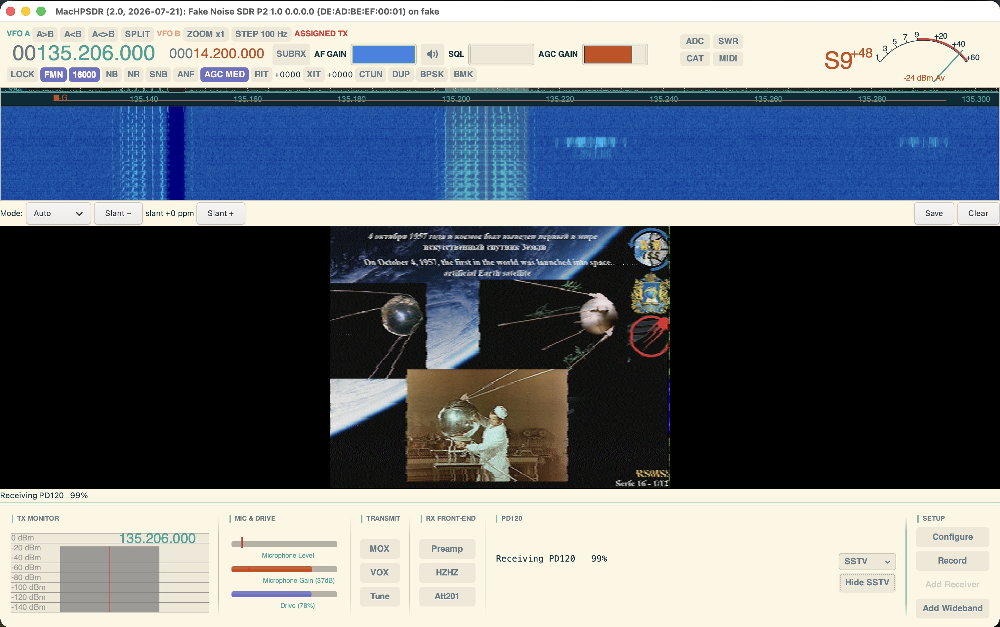
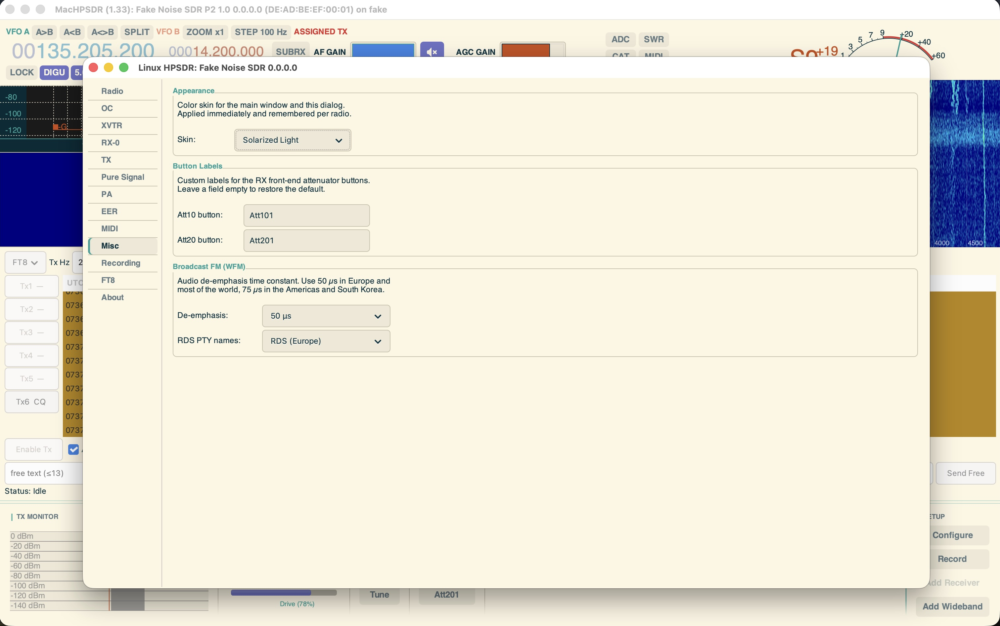

<div align="center">

# MacHPSDR

**A GTK4 SDR control application for HPSDR hardware — a macOS-focused fork of [LinHPSDR](https://github.com/g0orx/linhpsdr).**

*Single-window UI · colour skins · Broadcast FM + RDS · FT8/FT4 decode & QSO · SoapySDR RX/TX · I/Q recorder*

[](./LICENSE)
[]()
[]()

</div>

MacHPSDR is a personal fork of [LinHPSDR](https://github.com/g0orx/linhpsdr) by
John Melton (**G0ORX / N6LYT**), maintained mainly on macOS and with a number of
feature additions.

---

## Table of contents

- [Highlights](#highlights)
- [Screenshots](#screenshots)
- [Features](#features)
  - [Interface & appearance](#interface--appearance)
  - [Modes & decoding](#modes--decoding)
  - [SoapySDR / HackRF](#soapysdr--hackrf)
  - [Reliability & performance](#reliability--performance)
  - [HPSDR hardware](#hpsdr-hardware)
  - [Audio (macOS)](#audio-macos)
  - [macOS packaging](#macos-packaging)
- [Building](#building)
  - [macOS](#macos)
  - [Linux](#linux)
  - [WDSP (vendored)](#wdsp-vendored)
  - [CW support (Linux, optional)](#cw-support-linux-optional)
- [Running](#running)
- [User manual](#user-manual)
- [License](#license)

---

## Highlights

| Feature | Summary |
|---|---|
| **Single-window UI** | All receivers stacked in one resizable window with a bottom toolbar and log area — layout remembered between sessions. |
| **Colour skins** | Eleven dark/light schemes, redesigned S-meter & frequency display, selectable waterfall themes. |
| **Broadcast FM + RDS** | WFM reception on SoapySDR devices with stereo decoding and a full RDS panel. |
| **FT8 / FT4** | Opt-in decode in DIGU/DIGL (pick the decoder from the Decode block), plus transmit, auto-QSO, ADIF logging, PSK Reporter and a dedicated band waterfall. |
| **SSTV** | Receive **and transmit** analogue SSTV images (Martin, Scottie, Robot, PD — incl. ISS Robot 36 / PD120) with VIS auto-detect, an embedded image panel, PNG save and image-file transmit. |
| **WEFAX** | Receive HF radiofax / weather charts (DWD, NMG/NHC, Northwood, …) in DIGU/DIGL: continuous scrolling image, **self-aligning** (automatic phasing + start-tone detection), LPM (60/90/120/240) & IOC (576/288) selectors, AFC, slant trim and PNG save. Verified off-air. |
| **CW decoder + sender + keyer** | Decode Morse to text in CWL/CWU (auto tone-lock, adaptive WPM, live WPM/tone readout), **send CW** from eight editable message memories or free text (`%C` callsign macro), **and a software iambic keyer** (Curtis A/B) driven from the `[` / `]` keys or a MIDI paddle — no external program *(sending/keyer built + unit/round-trip-tested, not yet verified on air)*. |
| **HFDL** *(optional build)* | Decode **aviation HF Data Link** (ARINC 635) in DIGU: ground-station squitters, aircraft logon/logoff with ICAO addresses, position / performance / frequency reports and **ACARS message text** — a full coherent M-PSK receiver (1800 baud BPSK/QPSK/8-PSK, LMS equalizer, Viterbi FEC) with no external decoder. **Off in a stock build** — the port makes that build GPLv3, so enable it explicitly with `make HFDL_INCLUDE=HFDL` *(**verified on air**: decoded a real 11387 kHz recording of the Riverhead ground station — squitters, logons with ICAO addresses, position reports and ACARS text, matching a reference decoder frame for frame)*. |
| **DX cluster** | Connect to a telnet DX cluster; incoming spots are overlaid on the RX panadapter (colour-keyed by DXCC entity) and a click tunes straight onto the spotted station. |
| **TCI server** | Built-in TCI (Expert Electronics) server over WebSocket — loggers and skimmers (Log4OM, N1MM+, SkookumLogger, …) set and follow VFO, mode and PTT, pull the live **I/Q stream** (`iq_start`) for a skimmer/panadapter, and exchange **RX/TX audio** (`audio_start`) as a digital-mode VAC replacement — no virtual cable. Enable in **Configure → Network** *(control + I/Q + audio all implemented; verified with a WebSocket test client, not yet against a commercial logger; TX audio path unverified on air like the rest of the TX chain)*. |
| **Manual notch (MNF)** | Ctrl+click the RX spectrum to drop or remove your own notch filters; stored by absolute frequency (stay on-signal as you tune), up to 16 per receiver. |
| **Advanced noise reduction (NR3/NR4)** | Two extra denoisers on the VFO **NR** menu beside the classic NR/NR2: **NR3** (RNNoise recurrent neural network) and **NR4** (libspecbleach adaptive spectral subtraction), vendored and built into WDSP — no external install *(built + fake-tested; on-air audio not yet tuned on hardware)*. In the **data modes (DIGU/DIGL) and whenever a decoder is running** (FT8/FT4/SSTV/WEFAX/CW), **every waveform-altering block is automatically bypassed** — all four NR modes, the noise blankers (NB/NB2), the auto-notch (ANF), the spectral noise blanker (SNB) and the manual notches — so a modem/decoder or external software gets the clean signal (only demod, passband filter and AGC stay in). Your selections are kept and return the moment you leave the data mode / stop decoding. |
| **APF + variable squelch** | A CW **audio peak filter** (per-RX enable, bandwidth and gain in Configure → RX) that peaks the beat-note to lift weak CW out of the noise, plus a **mode-aware squelch** — the SQL bar now gates FM (noise squelch) *and* SSB/AM/CW (amplitude/voice squelch), remembered per receiver *(faker-tested; on-air threshold calibration pending hardware)*. |
| **Spectrum display modes** | A **peak-hold** overlay trace with adjustable decay, a **histogram / persistence** (virtual-phosphor) heat display with adjustable fade, plus selectable WDSP **detector** (Peak/Rosenfell/Average/Sample) and **averaging** (None/Recursive/Time Window/Log Recursive) modes — all per receiver and remembered between sessions. |
| **TX speech processing** | Full transmit speech chain — CESSB, multiband CFC, phase rotator, a 10-band EQ (TX+RX) and per-stage Leveler/CFC/Compressor meters *(built + fake-tested, not yet verified on air)*. |
| **SoapySDR TX** | Half-duplex transmit on HackRF / SoapySDR. |
| **I/Q recorder** | Record off-air I/Q + demodulated audio to WAV; the I/Q file replays through the fake device. |
| **PPM auto-calibration** | Set the oscillator correction automatically from a time-signal station's carrier (WWV/RWM/CHU/BPM…); fractional ppm, all device types. |
| **I/Q Player** | Play back a recorded I/Q WAV with no hardware — pick **"I/Q Player"** in the device list (always offered, last), then choose the file in **Configure → Radio** (live-swappable while it runs; empty ⇒ synthetic test signal). Also `--faker <file>` from the CLI. |

---

## Screenshots

**Main window** — all receivers in a single resizable window: panadapter and
waterfall, S-meter and frequency display, and the bottom toolbar (TX Monitor,
Mic & Drive, Transmit, RX Front-end, decoder block, Setup).


**FT8 panel** — the opt-in QSO panel with the rolling band-activity list (CQ rows
in green), Tx1–Tx6 messages, FT8/FT4 protocol selector and TX offset, alongside
the dedicated FT8 band waterfall on the right.


**SSTV** — a live ISS (ARISS) **PD120** image decoded off-air: the mode is
auto-detected and the picture is painted line-by-line beside the receiver.



**Settings** — Configure → Display: colour-skin selection (applied immediately and
remembered per radio), custom attenuator-button labels, and Broadcast FM
de-emphasis / RDS options. Every slider in the settings dialogs shows its
current numeric value beside the control, so you can read off the exact figure
you've dialled in.



---

## Features

### Interface & appearance

- **Single-window interface.** All receivers are stacked in one resizable main
  window instead of separate floating windows, with drag-to-resize dividers, a
  per-receiver close button, and a bottom toolbar and log area. Window size,
  layout and closed-receiver settings are remembered between sessions. Each
  receiver's VFO row has a compact mute (speaker) button next to the AF-gain
  slider that silences its audio without losing the volume setting; the mute
  state is remembered between sessions.

- **Per-mode filter & AGC memory.** Each mode keeps its own receive filter
  width *and* AGC speed (Off/Long/Slow/Medium/Fast): narrowing AM no longer
  narrows SSB, and switching, say, from SSB to CW restores the AGC setting that
  mode had last. Both are remembered per receiver between sessions.

- **Colour skins.** A dark interface with eleven selectable colour schemes
  (Charcoal, Solarized Dark, Solarized Light, Nord, Gruvbox Dark, Dracula,
  Tokyo Night, Catppuccin Mocha, Rosé Pine, One Dark, Gruvbox Light), chosen in
  **Configure → Display → Appearance** and remembered per radio. Includes a
  redesigned S-meter and frequency display. The waterfall has several selectable
  colour themes of its own, and the panadapter trace colour is chosen from a
  named drop-down (Gradient, Skin Accent, Red, Orange, Yellow, Green, Blue,
  Violet, Magenta, Cyan) instead of a numeric spin box. A **Show Panadapter**
  check box (per receiver, in the receiver settings dialog) turns the
  spectroscope off entirely — the waterfall then fills the whole spectrum area;
  the setting is remembered per receiver. A **Meter smoothing** slider (also per
  receiver, in the receiver settings dialog) sets the S-meter needle ballistics —
  0 makes it track instantly, higher values damp it like a mechanical meter
  (fast attack, slower decay); the default is 50 and it is remembered per receiver.

- **Spectrum display modes.** In the receiver settings dialog's **Panadapter**
  section: a **Peak Hold** check box overlays a max-hold trace (a light line that
  keeps the highest level seen at each point) on top of the live spectrum, with a
  **Peak Decay (dB/s)** slider controlling how fast the held peaks fall back (0 =
  hold forever). Two drop-downs also expose the WDSP display **Detector** (Peak,
  Rosenfell, Average, Sample) and **Averaging** (None, Recursive, Time Window, Log
  Recursive) modes, which used to be fixed. A **Histogram** check box turns on a
  **persistence** (virtual-phosphor) display — a heat-coloured density cloud that
  shows where the trace has spent time, with a **Persistence Decay** slider for how
  fast old activity fades. All are per receiver and remembered between sessions.

- **Freetune.** A tuning mode where the cursor moves within the visible span;
  exiting keeps the frequency you were on, and the radio retunes automatically
  when the cursor reaches a span edge. Changing the bandwidth re-centres the span
  on the frequency you are listening to, and zooming keeps that frequency centred.

- **VFO tuning.** Several ways to set the frequency on the VFO display:
  - **Mouse wheel** over a digit tunes by that digit's place value — wheel up
    tunes up, wheel down tunes down (consistent for VFO A/B and in
    ctun/freetune). The digit under the pointer is found by hit-testing the
    actual text, so it lands on exactly the digit you are hovering.
  - **Type a single digit** (SDR#-style): hover a digit and press a number key
    to overwrite that digit in place; the cursor then advances one digit to the
    right, so you can fill a frequency left-to-right by hovering the first digit
    and typing.
  - **Type the whole frequency:** a **left-click** on the VFO frequency opens a
    small pop-up field pre-filled with the current frequency (in MHz); edit or
    retype it (`.` or `,` decimal, and the grouped `14.074.000` style are both
    accepted) and press Enter to jump there, Esc to cancel. The **band-stack
    menu** is on the **right-click**.
  - Tuning is clamped to **0 – 6 GHz** (or the radio's own upper limit if it is
    lower, e.g. ~61 MHz for classic HPSDR), so a stray edit can't run the VFO
    off to a nonsense frequency.

- **Noise blankers & reduction.** Per-receiver toggles on the VFO row: **NB**/**NB2**
  (impulse-noise blankers), **ANF** (automatic notch) and **SNB** (Spectral Noise
  Blanker — a wideband spectral impulse remover). The **NR** button opens a menu
  with five states — OFF, **NR** (WDSP LMS/ANR), **NR2** (WDSP spectral/EMNR),
  **NR3** (RNNoise recurrent-neural-net denoiser) and **NR4** (libspecbleach
  adaptive spectral subtraction). NR3 and NR4 are vendored third-party libraries
  compiled straight into WDSP (RNNoise's model is baked in — nothing to download,
  no external install). Each toggle is remembered per receiver between sessions.
  NR4 has a **"Noise Reduction (NR4)" slider block** (Configure → RX-N: reduction,
  smoothing, whitening, noise rescale, post-filter) that tunes the spectral
  denoiser live while you listen.
  *(NR3/NR4 are built and fake-tested; their on-air audio has not yet been tuned
  on real hardware.)*

- **Audio peak filter (APF) for CW.** A narrow audio peaking filter that boosts
  the CW beat-note (centred on your sidetone pitch) to pull weak signals out of
  the noise. Enable it — with adjustable **bandwidth** (sharpness) and **gain** —
  in Configure → RX-N; it runs only in CWL/CWU and is remembered per receiver.
  *(Faker-tested; on-air benefit not yet judged on hardware.)*

- **Variable squelch (mode-aware).** The **SQL** bar on the VFO row is now
  mode-aware: in FM it drives the classic FM noise squelch, and in every other
  mode (SSB/AM/CW/digital) it drives an **amplitude / voice squelch** that mutes
  the channel until a signal exceeds the threshold. The bar at its minimum means
  squelch fully off (audio always passes); the setting is persisted per receiver.
  *(Faker-tested; the amplitude-squelch dB scale still needs calibration against
  a real on-air signal.)*

- **Manual notch filters (MNF).** In addition to the automatic notch (**ANF**),
  you can place your own notches to kill a steady carrier or heterodyne.
  **Ctrl+click** on the RX spectrum drops a notch at that frequency;
  **Ctrl+click** on an existing notch removes it. Each notch is drawn as a
  translucent red band with a centre line, is stored by absolute RF frequency so
  it stays on the offending signal as you tune, and is remembered per receiver
  between sessions (up to 16 notches). *(On-air notch depth is unverified — no
  receive hardware in this fork; the on-screen placement and tuning behaviour are
  faker-verified.)*

### Modes & decoding

- **Broadcast FM (WFM).** FM broadcast reception on SoapySDR devices (HackRF,
  RTL-SDR) with a selectable bandwidth and de-emphasis (50/75 µs), stereo
  decoding, and RDS. The RDS panel shows the station name, programme type,
  RadioText, the currently playing track, clock time and alternative frequencies.
  The bottom-bar decoder block is titled **RDS** only while the active receiver
  is in WFM; in other modes it carries the neutral **Decode** title and stays
  blank.

- **Decoder selection.** In the digital modes the Decode block shows a
  **decoder selector** (right-aligned). No decoder runs by default — pick one to
  start it. FT8/FT4 decode the audio and show the traffic in the Decode block
  (below); **SSTV** and **WEFAX** decode analogue images (see below). The
  selector **only lists the decoders usable in the current mode**: **DIGU/DIGL**
  offers **Off / FT8 / FT4 / SSTV / WEFAX**, while **NFM (FMN)** — where only
  SSTV applies (ISS/VHF SSTV over narrow FM) — offers just **Off / SSTV**. The
  selection is remembered between sessions.

- **SSTV image reception.** Choose **SSTV** from the Decode-block selector and
  press **Show SSTV** to open the image panel (it takes the second-receiver slot,
  like the FT8 panel). SSTV is available in **DIGU/DIGL** for **HF** SSTV (SSB,
  e.g. 14.230 MHz) *and* in **FMN** for **VHF/ISS** SSTV (narrowband FM — the ISS
  transmits on **145.800 MHz FM**, so tune it in **FMN** for Robot 36 / PD120). The decoder auto-detects the
  transmission mode from its VIS header and paints the picture line-by-line as it
  arrives. Supported modes: **Martin M1/M2**, **Scottie S1/S2/DX** (GBR — the HF
  workhorses, e.g. the 14.230 MHz calling frequency), **Robot 36/72** and
  **PD50/90/120/160/180/240** (YUV colour). This covers **ISS SSTV** — **Robot 36**
  (MAI-75) and **PD120** (ARISS commemorative events). **Auto** works even on FM,
  where the fast VIS header is smeared by de-emphasis: the decoder falls back to
  recognising the mode from its **sync-pulse line period**, so you normally don't
  need to pick anything. The **Mode** override (Auto + every mode) is still there
  for weak
  or missing VIS headers, an automatic
  slant corrector (the picture de-slants itself from the sync timing) with a
  manual **Slant ±** trim on top, **automatic frequency correction** (AFC — the
  picture stays correctly exposed and in sync as the ISS Doppler drifts, and the
  status shows the measured offset so you know when to nudge the dial), and
  **Save** (writes a PNG to `~/.local/share/machpsdr/sstv/`) / **Clear** buttons. Decoding is self-contained
  (its own Hilbert-transform FM discriminator; no WDSP/FFT dependency) and, like
  FT8, runs at full audio level regardless of the volume/mute so you can decode
  silently.

- **SSTV image transmission.** The image panel's **Tx** row sends a picture the
  same way: pick a **mode** (Martin/Scottie/Robot/PD), **Load…** any image file
  (it is fitted to the mode's geometry **preserving aspect ratio** — the sides
  that don't fill are letter-/pillar-boxed with black rather than stretched — and
  previewed in the panel), and press **Send**. It transmits a standard VIS header plus the FM-encoded scan lines
  through the normal phone TX chain, so it works on any protocol (Protocol 1/2,
  SoapySDR/HackRF): **DIGU/DIGL** for HF SSB SSTV (e.g. 14.230 MHz) and **FMN**
  for VHF FM. MOX is keyed automatically for the length of the picture (a
  progress bar tracks it) and dropped when it finishes, with a safety watchdog
  that force-unkeys if the TX path stalls. Press **Stop** to abort. The encoder
  is self-contained (no WDSP/FFT) and verified by an encode→decode loop-back
  (Martin M1, Scottie S1, Robot 36/72, PD120 → 8/8 colour bars pixel-correct).

- **WEFAX / HF radiofax reception.** Choose **WEFAX** from the Decode-block
  selector (in **DIGU/DIGL** — HF fax is USB) and press **Show WEFAX** to open the
  image panel (it takes the second-receiver slot, like the SSTV/FT8 panels). WEFAX
  is a *continuous* fax scan (weather charts and satellite images from stations
  such as DWD Hamburg, NMG New Orleans / NHC Miami, Northwood, …), so the picture
  scrolls as it arrives rather than being a fixed frame. It is designed to **just
  work**: with **Auto-phase** on (default) the decoder finds the fax's recurring
  vertical reference (its black margin / border) and pulls it to the left edge by
  itself, so the picture self-aligns with no clicking — it acquires the phase over
  the first ~20 lines and then holds it (no injected slant). **Auto-start** (also
  on by default) additionally spots a transmission's **start tone** (300 Hz for
  IOC 576 / 675 Hz for IOC 288) to begin a fresh page and seed the AFC. If you
  ever want to do it by hand, untick **Auto-phase** and **click the image** to set
  the left margin, use **Start** to begin a page, and **Slant ±** to deskew. The
  **LPM** (60/90/**120**/240) and **IOC** (**576**/288) selectors set the line
  timing (120 lpm / IOC 576 is the weather-fax standard, and the default). Two
  more automatic quality helpers run by default: an **auto-exposure AFC** anchors
  the white background to the correct level (so mistuning or drift can't wash the
  picture grey), and **Denoise** removes impulse-noise specks while keeping the
  thin chart lines — untick it for a completely raw image. Weather fax is
  **black-on-white** by convention; if a signal comes in reversed (wrong
  sideband, or a station with opposite polarity) tick **Invert** to flip it to a
  positive image. **Save**
  writes a PNG to `~/.local/share/machpsdr/wefax/`; **Clear** starts over. The
  image is decoded at the fax's native resolution (~1810 px/line for IOC 576) so
  the fine chart lines stay sharp rather than blurring to faint grey. Tune the
  station in **DIGU/USB** ~1.9 kHz below its assigned frequency so black lands on
  1500 Hz / white on 2300 Hz, and give it a **reasonably wide receive filter
  (~1.9 kHz, e.g. 1000–2900 Hz)** — a too-narrow filter smears the fast
  black↔white transitions and softens the picture. Like SSTV it is
  self-contained (its own Hilbert-transform FM discriminator, same 1500 Hz =
  black / 2300 Hz = white tone convention; no WDSP/FFT) and decodes at full audio
  level regardless of volume/mute.

- **FT8 / FT4 decoding.** Choose **FT8** or **FT4** from the Decode-block selector
  while the active receiver is in **DIGU** (or **DIGL**) — no separate window. The
  demodulated audio is tapped, decimated to 12 kHz, buffered into UTC time slots
  and decoded in a background thread. Decoding runs on a sliding window (re-run
  every ~2 s) rather than a single clock-locked slot, so it still works when the
  system clock is slightly off or when driving it from a looped I/Q recording.
  Decoded traffic (signal report, audio frequency, message text) appears in the
  bottom-bar decoder block, and the readout holds the last decodes until the next
  batch arrives. Requires an accurate system clock (UTC), like WSJT-X. The codec
  is the vendored [ft8_lib](https://github.com/kgoba/ft8_lib) by Kārlis Goba (MIT).

- **FT8 / FT4 transmit & auto-QSO.** An opt-in QSO panel drives the standard
  WSJT-X exchange (CQ → grid → report → RR73 → 73), keys TX on the opposite slot,
  and logs completed QSOs to ADIF. Includes worked-before / new-DXCC highlighting
  from `cty.dat`, network logging (WSJT-X-compatible UDP), **PSK Reporter** spot
  reporting, directed CQ, and a **dedicated FT8 band waterfall** (per-Hz zoom of
  the audio passband, click to set TX offset). An **FT8/FT4 selector** switches
  protocol throughout the decode/encode/QSO/reporting chain.

- **I/Q + demodulated-audio recorder.** A **Record** button streams two WAVs to
  the data folder: off-air I/Q (before the noise blanker, in the same format the
  `--faker` replay path reads — so it's loop-back-able) and clean demodulated
  audio at 48 kHz. Output folder and which streams to write are set in
  **Configure → Audio**.

- **TX speech processing chain.** A full transmit audio chain in
  **Configure → TX**:
  - **CESSB** (Controlled-Envelope SSB) overshoot control for more clean talk
    power on SSB.
  - **CFC** — a multiband **Continuous Frequency Compressor** (5-band profile at
    200 / 1 k / 2 k / 3 k / 4 k Hz, with pre-comp and a pre-emphasis stage).
  - **Phase Rotator** (asymmetry reduction for the human voice; adjustable corner
    frequency and number of stages).
  - A **10-band graphic equaliser** on **both** transmit and receive
    (32 Hz … 16 kHz plus a preamp band).
  - **Per-stage TX metering:** Leveler / CFC / Compressor gain-reduction readouts
    (dB) drawn under the ALC line on the TX panadapter, each shown only while its
    stage is on and you are transmitting.

  *(These are built and faker-smoke-tested but **unverified on air** — there is no
  transmit hardware in this fork. They need a real SSB transmitter and a monitor
  receiver to confirm they improve talk power and that the meters read sanely.)*

- **PureSignal.** Adaptive predistortion (Protocol 1 only), turned on in
  **Configure → PA / Linearity**. Still an unfinished prototype, calibrated mainly
  for the Hermes-Lite 2.

- **CW (Morse) decoder.** In **CWL/CWU** the Decode-block selector offers
  **Off / CW**; pick **CW** and the receiver's audio is decoded to text **right
  in the bottom Decode block** (a live WPM/tone line plus a rolling copy of the
  decoded text). A self-contained DSP chain (Goertzel tone-tracking →
  adaptive-WPM envelope → Morse table) locks onto the keyed tone, follows the
  sending speed automatically, and turns the dots/dashes into letters. **Show
  CW** is optional — it opens a bigger panel (in the second-RX slot, like the
  SSTV/FT8 panels) with full scrollback and a **Clear** button. No external
  program. *(Decoder verified on synthetic Morse audio; end-to-end off-air
  decode not yet confirmed on hardware. Works best on a single well-tuned signal
  in a narrow filter — heavy QRM garbles the text.)*
  The Show-CW panel also has a **TX row**: eight **message memories**
  (M1…M8, edited in **Configure → CW**, with a `%C` = your callsign macro) plus a
  **free-text** field, **Send**/**Stop** buttons and a live **WPM** control. It
  turns your text into a keyed sidetone at the configured speed/weight/pitch and
  feeds it into the CWL/CWU transmit chain (MOX keyed automatically, dropped when
  the message ends). *(The encoder is proven by an encode→decode round-trip test;
  the actual on-air signal is **not yet verified — there is no transmit hardware
  in this fork**.)*
  There is also a **software iambic keyer** (Curtis **Mode A / Mode B**, following
  the keyer speed / weight / paddle-reverse settings in **Configure → CW**). The
  two paddles are the `[` (dot) and `]` (dash) keys — active only in CWL/CWU — or
  a **MIDI** paddle mapped to the CW-left / CW-right actions. It produces proper
  iambic squeeze/alternation with dot-and-dash memory and a break-in hang. *(The
  A/B state machine is proven by a headless unit test; behaviour with a real
  paddle on the air is **unverified — no transmit hardware or physical paddle
  here**.)*

- **DX cluster + spot overlay.** Connect to a telnet DX cluster from
  **Configure → Network** (host / port / login call; a live status line). Incoming
  `DX de …` spots are stored (15-minute age-out) and drawn on every RX panadapter
  as a short tick plus the callsign, **colour-keyed by DXCC entity** (reusing the
  FT8 `cty.dat` resolver). **Left-click a spot marker to tune** the receiver
  straight onto the spotted frequency (works in normal, ctun and freetune modes,
  and tracks a SAT/RSAT split). The client runs in its own thread with automatic
  reconnect. *(The client, overlay and click-to-tune are built and faker-tested
  — including a live connect to a public cluster — but the on-air spot-line
  parsing and colouring have not been exercised against a busy cluster.)*

- **TCI server (Expert Electronics).** A built-in TCI control server, enabled in
  **Configure → Network** (port, default 40001; a live status line with the client
  count). TCI is the modern network-control protocol used by ExpertSDR-family
  radios and speaks a plain text command set (`vfo:…`, `modulation:…`, `trx:…`)
  over a **WebSocket** transport, so third-party loggers and skimmers (Log4OM,
  N1MM+, SkookumLogger, …) can both **set** and **follow** the radio's VFO, mode
  and PTT — a modern alternative to the legacy CAT/rigctl link, with no virtual
  serial or audio cable. Several clients may connect at once; the server runs in
  its own thread and never blocks the UI. **The live receiver I/Q stream is also
  served:** a client that sends `iq_start` receives the off-air I/Q as TCI binary
  frames (float32, at the receiver's sample rate) — enough to feed an external
  CW/RTTY **skimmer** or a third-party panadapter with no virtual audio cable.
  *(TCI treats a stream as I/Q only above 48 kHz, so run the receiver at 96/192
  kHz for skimmer use.)* **RX and TX audio** are also served (`audio_start`):
  the receiver's demodulated audio streams out as TCI audio frames, and a client
  may stream **TX audio in** — MacHPSDR substitutes it for the microphone while
  the client keys TX, so external digital-mode software can key and modulate the
  radio over TCI instead of a virtual audio cable (48 kHz, stereo float32). The
  TX-audio injection is inert unless a client is actively driving it, so the
  normal mic path is untouched. *(Control, the I/Q stream **and** RX audio are
  verified end-to-end with a raw-WebSocket test client on the fake device —
  correct frame headers, ~48/192 kS/s throughput, clean start/stop; TX audio is
  verified to ingest without disturbing the mic path but, like the whole TX
  chain, is unverified on air. Not yet exercised against a commercial logger or
  skimmer.)*

- **HFDL — aviation HF data link (optional build).** A complete receiver for
  HFDL (ARINC 635), the ACARS-carrying data link airliners use over the oceans:
  raw I/Q in, decoded messages out. The chain is a faithful port of `dumphfdl` —
  NCO downmix from the 1440 Hz carrier offset, resampling to the 1800-baud symbol
  domain, AGC and RRC matched filter, symbol-timing and Costas carrier recovery,
  A/M1 preamble correlation and mode selection, an **LMS equalizer** trained on
  the frame's training sequences (so multipath does not destroy the frame),
  de-interleaving, **Viterbi FEC** and descrambling, then the protocol stack:
  ground-station squitters (status and frequencies in use), aircraft logon/logoff
  with **ICAO addresses**, position / performance / frequency reports, and
  **ACARS message text** (registration, label, flight, message body). Aircraft
  IDs are resolved to ICAO addresses from the logon exchange, and an embedded
  ground-station table turns "frequency slot *n*" into real kilohertz. The
  application layer is a **native port**, not a link against libacars, so nothing
  large is vendored; CPDLC/ADS-C payloads and multi-block ACARS reassembly are
  deliberately left out. Select **HFDL** from the Decode block in **DIGU** and
  press **Show HFDL** for the message panel. **Not built by default** — the
  `dumphfdl` port is GPLv3, so the HFDL build is enabled explicitly with
  `make HFDL_INCLUDE=HFDL` and a stock build stays GPLv2. *(Every layer has a
  built-in self-test — timing/carrier recovery at zero bit errors, FEC round-trip
  with error correction, a full synthetic frame decoded bit-exactly through a
  2-tap multipath channel, and a full-stack test that reads an ACARS message back
  out of a synthesised frame. **Verified on air**: on a real 11387 kHz recording of the
  Riverhead, New York ground station it decoded 8 valid frames — SPDU squitters
  (TDMA frame index matching a reference decoder exactly), a ground-station uplink
  carrying two logon confirmations with real ICAO addresses, aircraft position and
  performance reports, and ACARS message text byte-for-byte identical to the
  reference decoder's output for the same frame.)*

### SoapySDR / HackRF

- **Transmit on HackRF / SoapySDR.** Half-duplex transmit over SoapySDR. Voice
  modes require a microphone input; the Drive slider controls output power. CW and
  PureSignal are not available on this path. The TX IQ rate is rounded to a
  multiple of the DSP rate (96 kHz) so WDSP's internal buffers stay consistent —
  without this HackRF crashed on key-up. Keys up on real hardware without
  crashing; on-air signal quality still needs more testing.

- **Window comes to the front on launch.** The main window is raised and given
  focus at startup (on macOS the app is also made the active application), so it
  no longer opens hidden behind the terminal you launched it from — most
  noticeable with `--faker`, which skips the device-selection dialog.

- **Test device / I/Q Player.** A built-in synthetic SDR runs the app with no
  hardware connected (receive, transmit, spectrum, demodulation) and can play
  back a recorded I/Q file. It is now **always offered in the device-selection
  list as "I/Q Player"** (listed last, after any real radios) — no CLI flag
  needed. Select it and click **Start Radio** to open it; with no file chosen it
  plays a synthetic noise+tones test signal.

- **I/Q file player.** Choose the WAV to loop in **Configure → Radio** (the
  **I/Q Player** frame: *Choose I/Q File…* / *Synthetic*). The choice is
  remembered and can be **swapped live while it plays**. You can also pass a file
  on the command line — `./machpsdr --faker ft8.wav` (skips the selection dialog;
  or set `MACHPSDR_FAKE_IQ=…`); the CLI file takes precedence over the saved one,
  and with no source it falls back to `iq.wav`. Any 16-bit stereo I/Q WAV works.
  The recording's sample rate is resampled to
  the receiver's rate and its carrier auto-centred to baseband, then looped. A
  6th-order Butterworth low-pass band-limits the resampled stream so the
  panadapter shows the file's own bandwidth rather than resampling images. If the
  sideband is inverted, tick **Swap I & Q** in the radio dialog to mirror the
  spectrum live.

### Reliability & performance

- **Disconnect recovery.** If the radio stops delivering data (a HackRF/SoapySDR
  device unplugged, or a network HPSDR radio going away), a watchdog detects the
  stall and pops a *Connection lost* dialog offering **Reconnect** or **Exit**,
  instead of freezing. Reconnect re-initialises the hardware in place while
  keeping your session; if the device is still missing the dialog reappears so you
  can retry.

- **Faster startup.** The Protocol 1 and Protocol 2 network discoveries now run in
  parallel, each waiting one second instead of two, so the device list appears in
  about a second rather than four. If you only use a USB device (HackRF, RTL-SDR),
  start with `--usb-only` to skip network discovery entirely.

- **Per-device ring-buffer depth (latency vs. glitch-free wide reception).** Wide
  reception needs a deep WDSP output ring so DSP-thread jitter at high sample
  rates (e.g. a wide span at 1536k/1920k) can't underrun into clicks — but a deep
  ring adds fixed audio latency to *every* mode on that receiver. The ring depth
  is now scaled at runtime to each receiver's span
  (`rx_ring_depth()` → `SetDSPMult()`):

  | Span | Ring depth |
  |------|:---------:|
  | ≤ 384k | 2 |
  | 768k | 4 |
  | 1536k | 8 |
  | 1920k | 16 |

  Narrow spans (which includes every HPSDR rate) get the original snappy
  low-latency ring; only genuinely wide spans pay for the deeper ring. The
  transmitter always uses depth 2.

### Dual receive & diversity

- **Sub-receiver (SUBRX).** A second demodulator inside the same slice of
  spectrum — toggled with the **SUBRX** button — lets you listen to two signals
  in one passband at once (its own VFO-B frequency, mode, filter, AGC and noise
  reduction). The main RX plays on the left channel and the sub on the right; a
  new **Sub-RX mix (split↔mono)** slider in the receiver settings crossfades from
  that hard L/R split all the way to an equal mono blend audible in both ears.
  Whether the sub-RX was on (and the mix setting) is now remembered across
  restarts.
- **Diversity reception** *(experimental — needs testing on real hardware).*
  Combines two coherent ADC streams with adjustable gain/phase to null a local
  interferer or fight fading. It lives on the **Configure → Diversity** page: an
  **Enable diversity** checkbox (greyed out on devices that can't do it) turns it
  on — adding a hidden second receiver and the mixer — alongside the gain/phase
  controls and a hardware-untested disclaimer. Like PureSignal it is Protocol 1
  only and has not yet been verified on hardware in this fork; it requires a radio
  with two receivers/ADCs.

### HPSDR hardware

- **PPM frequency correction with automatic calibration.** Corrects the
  reference-oscillator error (in fractional parts-per-million, so sub-ppm
  accuracy is possible on the high bands) and is applied on **all** device types
  — Classic HPSDR (Protocol 1), the enhanced Protocol 2, and SoapySDR. In
  **Configure → Display → Frequency Calibration (PPM)** you pick a time/frequency
  standard station (RWM, WWV, CHU, BPM on HF; MSF, DCF77, Droitwich on LF) and
  press **Calibrate** to measure its carrier and set the correction
  automatically, or **Tune** to zero-beat it by ear. The correction can also be
  entered manually.
- **Att 10 / Att 20 outputs usable as custom switches** — for example the
  attenuator outputs on a TRX-DUO or Red Pitaya can drive a transverter or filter
  switch. Labels are configurable in settings.

### Audio (macOS)

- The output and microphone device lists include a **System Default** entry that
  follows whatever macOS is currently using, so you can pick it once and never
  re-select when you connect Bluetooth headphones.
- Devices that don't run at 48 kHz (e.g. Bluetooth headsets locked to 44.1 kHz,
  previously hidden and silent) now appear and work — audio is resampled on the
  fly in both directions.
- The device lists are re-scanned each time you open the RX/TX audio page, so a
  headset connected after launch shows up without restarting.
- With **System Default** selected, changing the macOS output (or microphone)
  device while audio is playing now takes effect live — the stream re-opens onto
  the new default automatically. The switch is event-driven (a CoreAudio
  default-device listener), so it is near-instant and costs nothing while idle.
- The output also follows a device's *sample-rate* changes, so a Bluetooth headset
  flipping between its A2DP and hands-free (HFP) profiles no longer turns RX audio
  into garbage.

### macOS packaging

Builds a self-contained `MacHPSDR.app` bundle (`make app`); Cmd-Q quits the app,
and the required WDSP library is built and bundled automatically — no separate
install needed. The fork was renamed to MacHPSDR; existing settings are migrated
automatically on first run, and it ships with a new MacHPSDR application icon
(window, Dock and `.app` bundle).

---

## Building

> **Note.** Some additions rely on a patched WDSP (this fork adds a WFM
> demodulator and a couple of tweaks). The patched WDSP sources are **vendored in
> this repository under `wdsp/`** — do **not** clone WDSP separately; it is built
> and linked automatically by `make`.

### macOS

Development and testing has been run on macOS Sierra 10.12.6 and High Sierra
10.13.6. Prerequisites are installed with [Homebrew](https://brew.sh/).

```bash
brew install fftw gtk4 gnome-icon-theme libsoundio libffi soapysdr dylibbundler
```

```bash
git clone https://github.com/enthru/MacHPSDR.git machpsdr
cd machpsdr
make          # build ./machpsdr (runs in place)
make app      # optional: self-contained MacHPSDR.app bundle
```

`make app` bundles everything (GTK, the in-tree WDSP, resources) into
`MacHPSDR.app`, which you can then `open MacHPSDR.app` or drag to `/Applications`.
See [MacOS.md](./MacOS.md) for more detail.

**Self-contained bundle.** `make app` produces a `.app` that needs **no Homebrew
(or anything else) on the target machine** — all GTK/GLib libraries, gdk-pixbuf
loaders, themes and the in-tree WDSP are bundled and relinked into the app.

It also bundles the **SoapySDR device-driver modules** that are installed at build
time: every `.so` under `$(brew --prefix)/lib/SoapySDR/modules*` is copied into the
app and relinked (its `libhackrf` / `librtlsdr` / `libusb` dependencies are pulled
into `Frameworks`), and the launcher points `SOAPY_SDR_PLUGIN_PATH` at them. The
modules bundled and tested so far:

| SoapySDR module | Devices | Install |
|---|---|---|
| SoapyHackRF | HackRF | `brew install soapyhackrf` |
| SoapyRTLSDR | RTL-SDR | `brew install soapyrtlsdr` |

Install whichever you need **before** running `make app`.

> **Gatekeeper.** The bundle is ad-hoc signed, not notarized. If the `.app` is
> *downloaded* (and thus quarantined), first launch needs a right-click → **Open**,
> or `xattr -dr com.apple.quarantine MacHPSDR.app`. Copied locally, it just opens.
> The bundle is built for the architecture of the build machine (arm64 / Intel).

#### Adding other SoapySDR devices (optional, untested)

The bundling mechanism is generic — any SoapySDR module present under
`$(brew --prefix)/lib/SoapySDR/modules*` at `make app` time is packaged. The two
below aren't in Homebrew and haven't been tested with MacHPSDR yet, but if you
have the hardware you can build the module, then re-run `make app` to bundle it.
Build each with `-DCMAKE_INSTALL_PREFIX=$(brew --prefix)` so the `.so` lands in the
directory `make app` scans, and verify with `SoapySDRUtil --info` (the new driver
should appear under *Available factories*).

**ADALM-Pluto (SoapyPlutoSDR)** — needs `libiio` + `libad9361-iio`, both built
from source (Analog Devices):

```bash
git clone https://github.com/analogdevicesinc/libiio.git
cmake -S libiio -B libiio/build -DCMAKE_INSTALL_PREFIX=$(brew --prefix) -DHAVE_DNS_SD=OFF
cmake --build libiio/build -j$(sysctl -n hw.ncpu) && cmake --install libiio/build

git clone https://github.com/analogdevicesinc/libad9361-iio.git
cmake -S libad9361-iio -B libad9361-iio/build -DCMAKE_INSTALL_PREFIX=$(brew --prefix)
cmake --build libad9361-iio/build -j$(sysctl -n hw.ncpu) && cmake --install libad9361-iio/build

git clone https://github.com/pothosware/SoapyPlutoSDR.git
cmake -S SoapyPlutoSDR -B SoapyPlutoSDR/build -DCMAKE_INSTALL_PREFIX=$(brew --prefix)
cmake --build SoapyPlutoSDR/build -j$(sysctl -n hw.ncpu) && cmake --install SoapyPlutoSDR/build
```

> If SoapyPlutoSDR fails against libiio's API, check out libiio `v0.25`
> (`git -C libiio checkout v0.25`) and rebuild — libiio 1.x can be incompatible.

**SDRplay RSP1/RSP1A/RSP1B/RSP2/RSPduo/RSPdx (SoapySDRPlay3)** — first install the
proprietary **SDRplay API v3** (macOS installer from
<https://www.sdrplay.com/downloads/>; it also installs the `sdrplay_apiService`
daemon), then build the module:

```bash
git clone https://github.com/pothosware/SoapySDRPlay3.git
cmake -S SoapySDRPlay3 -B SoapySDRPlay3/build -DCMAKE_INSTALL_PREFIX=$(brew --prefix)
cmake --build SoapySDRPlay3/build -j$(sysctl -n hw.ncpu) && cmake --install SoapySDRPlay3/build
```

> Note: even after bundling, SDRplay's **API service daemon must be installed and
> running on the target machine** — it can't be shipped inside the `.app`, so RSP
> devices are not fully install-free.

### Linux

Development and testing has been run on Ubuntu and Arch Linux. The build now
requires **GTK 4** (`libgtk-4-dev` / `gtk4`); GTK 3 is no longer supported.

```bash
sudo apt-get install libfftw3-dev libpulse-dev libsoundio-dev \
                     libasound2-dev libgtk-4-dev libsoapysdr-dev
```

```bash
git clone https://github.com/enthru/MacHPSDR.git machpsdr
cd machpsdr
make
```

> **Do not** `git clone .../wdsp` and `sudo make install` it. This fork links the
> **vendored, patched** WDSP under `wdsp/`; a system-wide upstream WDSP would
> build but silently break this fork's WFM demod and other DSP tweaks. `make`
> builds `wdsp/libwdsp.so` for you and the binary finds it via an `$ORIGIN` rpath,
> so `./machpsdr` runs straight from the repo with no WDSP install. See
> [WDSP (vendored)](#wdsp-vendored).

### WDSP (vendored)

The patched WDSP this fork needs is vendored in `wdsp/` (do **not** clone or
install it separately — see above). On **both macOS and Linux** it is built
automatically as part of `make` / `make app`, and MacHPSDR links against that
in-tree copy: `wdsp/libwdsp.dylib` on macOS, `wdsp/libwdsp.so` on Linux. No
separate WDSP build or system-wide install is required or wanted — an upstream
`-lwdsp` from `/usr/local` would compile but break the fork's patches. The binary
locates the in-tree library at run time via an rpath (`@loader_path/wdsp` on
macOS, `$ORIGIN/wdsp` on Linux), so it runs in place from the repo.

### CW support (Linux, optional)

Hermes and HL2 CWX / cwdaemon support (tested on Ubuntu 19.10, Kubuntu 18.04
LTS). If you don't need it, skip this section.

```bash
sudo apt install libtool
git clone https://git.code.sf.net/p/unixcw/code unixcw-code
cd unixcw-code
git fetch --tags
git checkout tags/v3.6.0
autoreconf -i
./configure
make
sudo make install
sudo ldconfig
```

Then enable it in the `Makefile` by uncommenting the `CWDAEMON` block:

```make
CWDAEMON_INCLUDE=CWDAEMON

ifeq ($(CWDAEMON_INCLUDE),CWDAEMON)
CWDAEMON_OPTIONS=-D CWDAEMON
CWDAEMON_LIBS=-lcw
CWDAEMON_SOURCES= cwdaemon.c
CWDAEMON_HEADERS= cwdaemon.h
CWDAEMON_OBJS= cwdaemon.o
endif
```

---

## Running

There is **no `make install`** target — the `machpsdr` binary runs in place.
Start it from the build directory:

```bash
./machpsdr                 # normal start (device discovery)
./machpsdr --usb-only      # skip network discovery (USB devices only)
./machpsdr --faker ft8.wav # no hardware: loop an I/Q WAV through the RX chain
./machpsdr --debug         # verbose diagnostic logging
```

### Logging

Console output is levelled — `ERROR`, `INFO` (default) and `DEBUG` — and each
line is tagged with its level (e.g. `[INFO] …`). Choose the threshold from the
command line or the environment; the command line wins:

```bash
./machpsdr --log-level debug   # or --log-level=debug
./machpsdr --debug             # shorthand for --log-level debug (also -v / --verbose)
./machpsdr --quiet             # errors only (also -q, i.e. --log-level error)
MACHPSDR_LOG=debug ./machpsdr  # via the environment
```

`INFO` shows the normal start-up / status chatter; `DEBUG` adds hot-path and
per-slot traces (audio callbacks, FT8 TX slot timing, etc.); `ERROR` shows only
failures.

### Passing flags to the `.app` bundle

The `MacHPSDR.app` bundle's launcher
(`MacHPSDR.app/Contents/MacOS/MacHPSDR`) is a small wrapper that sets up the
bundled library/plugin environment and then `exec`s the real binary, **passing
any arguments straight through**. So the same flags work on the bundle — call
the launcher directly:

```bash
# no hardware: loop an I/Q WAV through the RX chain
MacHPSDR.app/Contents/MacOS/MacHPSDR --faker /full/path/to/ft8.wav
```

Two gotchas:

- The launcher `cd`s into the bundle's `Resources` directory before starting,
  so give the WAV as an **absolute path** — a relative one won't be found.
- `open MacHPSDR.app` (double-clicking, or `open`) launches via LaunchServices
  and does **not** forward these arguments; run the launcher directly (as
  above) when you need `--faker`, `--usb-only`, etc. `sudo open …` likewise does
  not elevate — to run as root, `sudo` the launcher directly:
  `sudo MacHPSDR.app/Contents/MacOS/MacHPSDR` (note: as root the config/logs go
  to `/var/root/.local/share/machpsdr/`).

---

## User manual

A general overview of the main functions (window layout, tuning, receiver
controls, TX, FT8/FT4, the recorder, configuration, MIDI, the fake device) is in
[`doc/`](./doc):

- English — [`doc/manual-en.md`](./doc/manual-en.md)
- Русский — [`doc/manual-ru.md`](./doc/manual-ru.md)
- Українська — [`doc/manual-uk.md`](./doc/manual-uk.md)
- Беларуская — [`doc/manual-be.md`](./doc/manual-be.md)

---

## License

MacHPSDR, like the LinHPSDR it derives from, is free software released under the
**GNU General Public License** — GPLv2 or, at your option, any later version (see
[`LICENSE`](./LICENSE)). The bundled WDSP DSP library (in `wdsp/`) is licensed
under the **GNU GPL v2** (see `wdsp/COPYING`).
