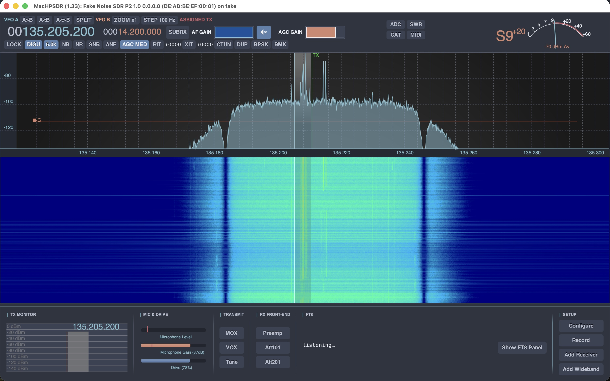
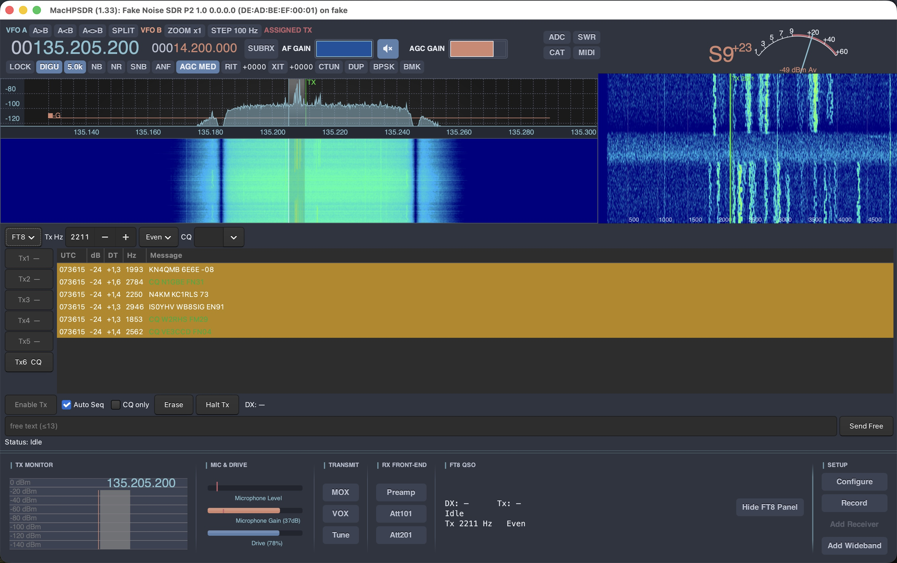

<div align="center">

# MacHPSDR

**A GTK3 SDR control application for HPSDR hardware — a macOS-focused fork of [LinHPSDR](https://github.com/g0orx/linhpsdr).**

*Single-window UI · colour skins · Broadcast FM + RDS · FT8/FT4 decode & QSO · SoapySDR RX/TX · I/Q recorder*

[](./LICENSE)
[]()
[]()

</div>

MacHPSDR is a personal fork of [LinHPSDR](https://github.com/g0orx/linhpsdr) by
John Melton (**G0ORX / N6LYT**), maintained mainly on macOS and with a number of
feature additions.

---

## Table of contents

- [Highlights](#highlights)
- [Screenshots](#screenshots)
- [Features](#features)
  - [Interface & appearance](#interface--appearance)
  - [Modes & decoding](#modes--decoding)
  - [SoapySDR / HackRF](#soapysdr--hackrf)
  - [Reliability & performance](#reliability--performance)
  - [HPSDR hardware](#hpsdr-hardware)
  - [Audio (macOS)](#audio-macos)
  - [macOS packaging](#macos-packaging)
- [Building](#building)
  - [macOS](#macos)
  - [Linux](#linux)
  - [WDSP (vendored)](#wdsp-vendored)
  - [CW support (Linux, optional)](#cw-support-linux-optional)
- [Running](#running)
- [User manual](#user-manual)
- [License](#license)

---

## Highlights

| Feature | Summary |
|---|---|
| **Single-window UI** | All receivers stacked in one resizable window with a bottom toolbar and log area — layout remembered between sessions. |
| **Colour skins** | Five dark/light schemes, redesigned S-meter & frequency display, selectable waterfall themes. |
| **Broadcast FM + RDS** | WFM reception on SoapySDR devices with stereo decoding and a full RDS panel. |
| **FT8 / FT4** | Opt-in decode in DIGU/DIGL (pick the decoder from the Decode block), plus transmit, auto-QSO, ADIF logging, PSK Reporter and a dedicated band waterfall. |
| **SSTV** | Receive analogue SSTV images (Martin, Scottie, Robot, PD — incl. ISS Robot 36 / PD120) with VIS auto-detect, an embedded image panel and PNG save. |
| **SoapySDR TX** | Half-duplex transmit on HackRF / SoapySDR. |
| **I/Q recorder** | Record off-air I/Q + demodulated audio to WAV; the I/Q file replays through the fake device. |
| **PPM auto-calibration** | Set the oscillator correction automatically from a time-signal station's carrier (WWV/RWM/CHU/BPM…); fractional ppm, all device types. |
| **Fake device** | Run with no hardware and loop back a recorded I/Q file. |

---

## Screenshots

**Main window** — all receivers in a single resizable window: panadapter and
waterfall, S-meter and frequency display, and the bottom toolbar (TX Monitor,
Mic & Drive, Transmit, RX Front-end, decoder block, Setup).



**FT8 panel** — the opt-in QSO panel with the rolling band-activity list (CQ rows
in green), Tx1–Tx6 messages, FT8/FT4 protocol selector and TX offset, alongside
the dedicated FT8 band waterfall on the right.



**Settings** — Configure → Misc: colour-skin selection (applied immediately and
remembered per radio), custom attenuator-button labels, and Broadcast FM
de-emphasis / RDS options.


---

## Features

### Interface & appearance

- **Single-window interface.** All receivers are stacked in one resizable main
  window instead of separate floating windows, with drag-to-resize dividers, a
  per-receiver close button, and a bottom toolbar and log area. Window size,
  layout and closed-receiver settings are remembered between sessions. Each
  receiver's VFO row has a compact mute (speaker) button next to the AF-gain
  slider that silences its audio without losing the volume setting; the mute
  state is remembered between sessions.

- **Colour skins.** A dark interface with five selectable colour schemes
  (Charcoal, Solarized Dark, Solarized Light, Nord, Gruvbox), chosen in
  **Configure → Misc → Appearance** and remembered per radio. Includes a
  redesigned S-meter and frequency display. The waterfall has several selectable
  colour themes of its own, and the panadapter trace colour is chosen from a
  named drop-down (Gradient, Skin Accent, Red, Orange, Yellow, Green, Blue,
  Violet, Magenta, Cyan) instead of a numeric spin box.

- **Freetune.** A tuning mode where the cursor moves within the visible span;
  exiting keeps the frequency you were on, and the radio retunes automatically
  when the cursor reaches a span edge. Changing the bandwidth re-centres the span
  on the frequency you are listening to, and zooming keeps that frequency centred.

### Modes & decoding

- **Broadcast FM (WFM).** FM broadcast reception on SoapySDR devices (HackRF,
  RTL-SDR) with a selectable bandwidth and de-emphasis (50/75 µs), stereo
  decoding, and RDS. The RDS panel shows the station name, programme type,
  RadioText, the currently playing track, clock time and alternative frequencies.
  The bottom-bar decoder block is titled **RDS** only while the active receiver
  is in WFM; in other modes it carries the neutral **Decode** title and stays
  blank.

- **Decoder selection (DIGU/DIGL).** In the digital modes the Decode block shows
  a **decoder selector** (right-aligned): **Off / FT8 / FT4 / SSTV**. No decoder
  runs by default — pick one to start it. FT8/FT4 decode the audio and show the
  traffic in the Decode block (below); **SSTV** decodes analogue images (see
  below). The selection is remembered between sessions.

- **SSTV image reception.** Choose **SSTV** from the Decode-block selector and
  press **Show SSTV** to open the image panel (it takes the second-receiver slot,
  like the FT8 panel). SSTV is available in **DIGU/DIGL** for **HF** SSTV (SSB,
  e.g. 14.230 MHz) *and* in **FMN** for **VHF/ISS** SSTV (narrowband FM — the ISS
  transmits on **145.800 MHz FM**, so tune it in **FMN** for Robot 36 / PD120). The decoder auto-detects the
  transmission mode from its VIS header and paints the picture line-by-line as it
  arrives. Supported modes: **Martin M1/M2**, **Scottie S1/S2/DX** (GBR — the HF
  workhorses, e.g. the 14.230 MHz calling frequency), **Robot 36/72** and
  **PD50/90/120/160/180/240** (YUV colour). This covers **ISS SSTV** — **Robot 36**
  (MAI-75) and **PD120** (ARISS commemorative events). The panel has a **Mode**
  override (Auto + every mode) for weak
  or missing VIS headers, a **Slant ±** trim, and **Save** (writes a PNG to
  `~/.local/share/machpsdr/sstv/`) / **Clear** buttons. Decoding is self-contained
  (its own Hilbert-transform FM discriminator; no WDSP/FFT dependency) and, like
  FT8, runs at full audio level regardless of the volume/mute so you can decode
  silently.

- **FT8 / FT4 decoding.** Choose **FT8** or **FT4** from the Decode-block selector
  while the active receiver is in **DIGU** (or **DIGL**) — no separate window. The
  demodulated audio is tapped, decimated to 12 kHz, buffered into UTC time slots
  and decoded in a background thread. Decoding runs on a sliding window (re-run
  every ~2 s) rather than a single clock-locked slot, so it still works when the
  system clock is slightly off or when driving it from a looped I/Q recording.
  Decoded traffic (signal report, audio frequency, message text) appears in the
  bottom-bar decoder block, and the readout holds the last decodes until the next
  batch arrives. Requires an accurate system clock (UTC), like WSJT-X. The codec
  is the vendored [ft8_lib](https://github.com/kgoba/ft8_lib) by Kārlis Goba (MIT).

- **FT8 / FT4 transmit & auto-QSO.** An opt-in QSO panel drives the standard
  WSJT-X exchange (CQ → grid → report → RR73 → 73), keys TX on the opposite slot,
  and logs completed QSOs to ADIF. Includes worked-before / new-DXCC highlighting
  from `cty.dat`, network logging (WSJT-X-compatible UDP), **PSK Reporter** spot
  reporting, directed CQ, and a **dedicated FT8 band waterfall** (per-Hz zoom of
  the audio passband, click to set TX offset). An **FT8/FT4 selector** switches
  protocol throughout the decode/encode/QSO/reporting chain.

- **I/Q + demodulated-audio recorder.** A **Record** button streams two WAVs to
  the data folder: off-air I/Q (before the noise blanker, in the same format the
  `--faker` replay path reads — so it's loop-back-able) and clean demodulated
  audio at 48 kHz. Output folder and which streams to write are set in
  **Configure → Recording**.

- **PureSignal.** Adaptive predistortion (Protocol 1 only), turned on in
  **Configure → Pure Signal**. Still an unfinished prototype, calibrated mainly
  for the Hermes-Lite 2.

### SoapySDR / HackRF

- **Transmit on HackRF / SoapySDR.** Half-duplex transmit over SoapySDR. Voice
  modes require a microphone input; the Drive slider controls output power. CW and
  PureSignal are not available on this path. The TX IQ rate is rounded to a
  multiple of the DSP rate (96 kHz) so WDSP's internal buffers stay consistent —
  without this HackRF crashed on key-up. Keys up on real hardware without
  crashing; on-air signal quality still needs more testing.

- **Test device.** A built-in *Fake Noise SDR* runs the app with no hardware
  connected (receive, transmit, spectrum, demodulation) and can play back a
  recorded I/Q file. Hidden by default; enable it with `--faker`.

- **I/Q file player for the fake device.** The `--faker` device can loop any
  16-bit stereo I/Q WAV instead of the built-in noise+tones. Pass the file
  directly — `./machpsdr --faker ft8.wav` (or set `MACHPSDR_FAKE_IQ=…`); with no
  argument it falls back to `iq.wav`. The recording's sample rate is resampled to
  the receiver's rate and its carrier auto-centred to baseband, then looped. A
  6th-order Butterworth low-pass band-limits the resampled stream so the
  panadapter shows the file's own bandwidth rather than resampling images. Add
  `--revert-iq` to swap I and Q (mirrors the spectrum) when the sideband is
  inverted.

### Reliability & performance

- **Disconnect recovery.** If the radio stops delivering data (a HackRF/SoapySDR
  device unplugged, or a network HPSDR radio going away), a watchdog detects the
  stall and pops a *Connection lost* dialog offering **Reconnect** or **Exit**,
  instead of freezing. Reconnect re-initialises the hardware in place while
  keeping your session; if the device is still missing the dialog reappears so you
  can retry.

- **Faster startup.** The Protocol 1 and Protocol 2 network discoveries now run in
  parallel, each waiting one second instead of two, so the device list appears in
  about a second rather than four. If you only use a USB device (HackRF, RTL-SDR),
  start with `--usb-only` to skip network discovery entirely.

- **Per-device ring-buffer depth (latency vs. glitch-free wide reception).** Wide
  reception needs a deep WDSP output ring so DSP-thread jitter at high sample
  rates (e.g. a wide span at 1536k/1920k) can't underrun into clicks — but a deep
  ring adds fixed audio latency to *every* mode on that receiver. The ring depth
  is now scaled at runtime to each receiver's span
  (`rx_ring_depth()` → `SetDSPMult()`):

  | Span | Ring depth |
  |------|:---------:|
  | ≤ 384k | 2 |
  | 768k | 4 |
  | 1536k | 8 |
  | 1920k | 16 |

  Narrow spans (which includes every HPSDR rate) get the original snappy
  low-latency ring; only genuinely wide spans pay for the deeper ring. The
  transmitter always uses depth 2.

### HPSDR hardware

- **PPM frequency correction with automatic calibration.** Corrects the
  reference-oscillator error (in fractional parts-per-million, so sub-ppm
  accuracy is possible on the high bands) and is applied on **all** device types
  — Classic HPSDR (Protocol 1), the enhanced Protocol 2, and SoapySDR. In
  **Configure → Misc → Frequency Calibration (PPM)** you pick a time/frequency
  standard station (RWM, WWV, CHU, BPM on HF; MSF, DCF77, Droitwich on LF) and
  press **Calibrate** to measure its carrier and set the correction
  automatically, or **Tune** to zero-beat it by ear. The correction can also be
  entered manually.
- **Att 10 / Att 20 outputs usable as custom switches** — for example the
  attenuator outputs on a TRX-DUO or Red Pitaya can drive a transverter or filter
  switch. Labels are configurable in settings.

### Audio (macOS)

- The output and microphone device lists include a **System Default** entry that
  follows whatever macOS is currently using, so you can pick it once and never
  re-select when you connect Bluetooth headphones.
- Devices that don't run at 48 kHz (e.g. Bluetooth headsets locked to 44.1 kHz,
  previously hidden and silent) now appear and work — audio is resampled on the
  fly in both directions.
- The device lists are re-scanned each time you open the RX/TX audio page, so a
  headset connected after launch shows up without restarting.
- With **System Default** selected, changing the macOS output (or microphone)
  device while audio is playing now takes effect live — the stream re-opens onto
  the new default automatically. The switch is event-driven (a CoreAudio
  default-device listener), so it is near-instant and costs nothing while idle.
- The output also follows a device's *sample-rate* changes, so a Bluetooth headset
  flipping between its A2DP and hands-free (HFP) profiles no longer turns RX audio
  into garbage.

### macOS packaging

Builds a self-contained `MacHPSDR.app` bundle (`make app`); Cmd-Q quits the app,
and the required WDSP library is built and bundled automatically — no separate
install needed. The fork was renamed to MacHPSDR; existing settings are migrated
automatically on first run, and it ships with a new MacHPSDR application icon
(window, Dock and `.app` bundle).

---

## Building

> **Note.** Some additions rely on a patched WDSP (this fork adds a WFM
> demodulator and a couple of tweaks). The patched WDSP sources are **vendored in
> this repository under `wdsp/`** — do **not** clone WDSP separately; it is built
> and linked automatically by `make`.

### macOS

Development and testing has been run on macOS Sierra 10.12.6 and High Sierra
10.13.6. Prerequisites are installed with [Homebrew](https://brew.sh/).

```bash
brew install fftw gtk+3 gnome-icon-theme libsoundio libffi soapysdr dylibbundler
```

```bash
git clone https://github.com/enthru/MacHPSDR.git machpsdr
cd machpsdr
make          # build ./machpsdr (runs in place)
make app      # optional: self-contained MacHPSDR.app bundle
```

`make app` bundles everything (GTK, the in-tree WDSP, resources) into
`MacHPSDR.app`, which you can then `open MacHPSDR.app` or drag to `/Applications`.
See [MacOS.md](./MacOS.md) for more detail.

**Self-contained bundle.** `make app` produces a `.app` that needs **no Homebrew
(or anything else) on the target machine** — all GTK/GLib libraries, gdk-pixbuf
loaders, themes and the in-tree WDSP are bundled and relinked into the app.

It also bundles the **SoapySDR device-driver modules** that are installed at build
time: every `.so` under `$(brew --prefix)/lib/SoapySDR/modules*` is copied into the
app and relinked (its `libhackrf` / `librtlsdr` / `libusb` dependencies are pulled
into `Frameworks`), and the launcher points `SOAPY_SDR_PLUGIN_PATH` at them. The
modules bundled and tested so far:

| SoapySDR module | Devices | Install |
|---|---|---|
| SoapyHackRF | HackRF | `brew install soapyhackrf` |
| SoapyRTLSDR | RTL-SDR | `brew install soapyrtlsdr` |

Install whichever you need **before** running `make app`.

> **Gatekeeper.** The bundle is ad-hoc signed, not notarized. If the `.app` is
> *downloaded* (and thus quarantined), first launch needs a right-click → **Open**,
> or `xattr -dr com.apple.quarantine MacHPSDR.app`. Copied locally, it just opens.
> The bundle is built for the architecture of the build machine (arm64 / Intel).

#### Adding other SoapySDR devices (optional, untested)

The bundling mechanism is generic — any SoapySDR module present under
`$(brew --prefix)/lib/SoapySDR/modules*` at `make app` time is packaged. The two
below aren't in Homebrew and haven't been tested with MacHPSDR yet, but if you
have the hardware you can build the module, then re-run `make app` to bundle it.
Build each with `-DCMAKE_INSTALL_PREFIX=$(brew --prefix)` so the `.so` lands in the
directory `make app` scans, and verify with `SoapySDRUtil --info` (the new driver
should appear under *Available factories*).

**ADALM-Pluto (SoapyPlutoSDR)** — needs `libiio` + `libad9361-iio`, both built
from source (Analog Devices):

```bash
git clone https://github.com/analogdevicesinc/libiio.git
cmake -S libiio -B libiio/build -DCMAKE_INSTALL_PREFIX=$(brew --prefix) -DHAVE_DNS_SD=OFF
cmake --build libiio/build -j$(sysctl -n hw.ncpu) && cmake --install libiio/build

git clone https://github.com/analogdevicesinc/libad9361-iio.git
cmake -S libad9361-iio -B libad9361-iio/build -DCMAKE_INSTALL_PREFIX=$(brew --prefix)
cmake --build libad9361-iio/build -j$(sysctl -n hw.ncpu) && cmake --install libad9361-iio/build

git clone https://github.com/pothosware/SoapyPlutoSDR.git
cmake -S SoapyPlutoSDR -B SoapyPlutoSDR/build -DCMAKE_INSTALL_PREFIX=$(brew --prefix)
cmake --build SoapyPlutoSDR/build -j$(sysctl -n hw.ncpu) && cmake --install SoapyPlutoSDR/build
```

> If SoapyPlutoSDR fails against libiio's API, check out libiio `v0.25`
> (`git -C libiio checkout v0.25`) and rebuild — libiio 1.x can be incompatible.

**SDRplay RSP1/RSP1A/RSP1B/RSP2/RSPduo/RSPdx (SoapySDRPlay3)** — first install the
proprietary **SDRplay API v3** (macOS installer from
<https://www.sdrplay.com/downloads/>; it also installs the `sdrplay_apiService`
daemon), then build the module:

```bash
git clone https://github.com/pothosware/SoapySDRPlay3.git
cmake -S SoapySDRPlay3 -B SoapySDRPlay3/build -DCMAKE_INSTALL_PREFIX=$(brew --prefix)
cmake --build SoapySDRPlay3/build -j$(sysctl -n hw.ncpu) && cmake --install SoapySDRPlay3/build
```

> Note: even after bundling, SDRplay's **API service daemon must be installed and
> running on the target machine** — it can't be shipped inside the `.app`, so RSP
> devices are not fully install-free.

### Linux

Development and testing has been run on Ubuntu and Arch Linux. On very early GTK
versions there may be an issue with `gtk_menu_popup_at_pointer` in `vfo.c`.

```bash
sudo apt-get install libfftw3-dev libpulse-dev libsoundio-dev \
                     libasound2-dev libgtk-3-dev libsoapysdr-dev
```

```bash
git clone https://github.com/enthru/MacHPSDR.git machpsdr
cd machpsdr
make
```

> **Do not** `git clone .../wdsp` and `sudo make install` it. This fork links the
> **vendored, patched** WDSP under `wdsp/`; a system-wide upstream WDSP would
> build but silently break this fork's WFM demod and other DSP tweaks. `make`
> builds `wdsp/libwdsp.so` for you and the binary finds it via an `$ORIGIN` rpath,
> so `./machpsdr` runs straight from the repo with no WDSP install. See
> [WDSP (vendored)](#wdsp-vendored).

### WDSP (vendored)

The patched WDSP this fork needs is vendored in `wdsp/` (do **not** clone or
install it separately — see above). On **both macOS and Linux** it is built
automatically as part of `make` / `make app`, and MacHPSDR links against that
in-tree copy: `wdsp/libwdsp.dylib` on macOS, `wdsp/libwdsp.so` on Linux. No
separate WDSP build or system-wide install is required or wanted — an upstream
`-lwdsp` from `/usr/local` would compile but break the fork's patches. The binary
locates the in-tree library at run time via an rpath (`@loader_path/wdsp` on
macOS, `$ORIGIN/wdsp` on Linux), so it runs in place from the repo.

### CW support (Linux, optional)

Hermes and HL2 CWX / cwdaemon support (tested on Ubuntu 19.10, Kubuntu 18.04
LTS). If you don't need it, skip this section.

```bash
sudo apt install libtool
git clone https://git.code.sf.net/p/unixcw/code unixcw-code
cd unixcw-code
git fetch --tags
git checkout tags/v3.6.0
autoreconf -i
./configure
make
sudo make install
sudo ldconfig
```

Then enable it in the `Makefile` by uncommenting the `CWDAEMON` block:

```make
CWDAEMON_INCLUDE=CWDAEMON

ifeq ($(CWDAEMON_INCLUDE),CWDAEMON)
CWDAEMON_OPTIONS=-D CWDAEMON
CWDAEMON_LIBS=-lcw
CWDAEMON_SOURCES= cwdaemon.c
CWDAEMON_HEADERS= cwdaemon.h
CWDAEMON_OBJS= cwdaemon.o
endif
```

---

## Running

There is **no `make install`** target — the `machpsdr` binary runs in place.
Start it from the build directory:

```bash
./machpsdr                 # normal start (device discovery)
./machpsdr --usb-only      # skip network discovery (USB devices only)
./machpsdr --faker ft8.wav # no hardware: loop an I/Q WAV through the RX chain
./machpsdr --debug         # verbose diagnostic logging
```

### Logging

Console output is levelled — `ERROR`, `INFO` (default) and `DEBUG` — and each
line is tagged with its level (e.g. `[INFO] …`). Choose the threshold from the
command line or the environment; the command line wins:

```bash
./machpsdr --log-level debug   # or --log-level=debug
./machpsdr --debug             # shorthand for --log-level debug (also -v / --verbose)
./machpsdr --quiet             # errors only (also -q, i.e. --log-level error)
MACHPSDR_LOG=debug ./machpsdr  # via the environment
```

`INFO` shows the normal start-up / status chatter; `DEBUG` adds hot-path and
per-slot traces (audio callbacks, FT8 TX slot timing, etc.); `ERROR` shows only
failures.

### Passing flags to the `.app` bundle

The `MacHPSDR.app` bundle's launcher
(`MacHPSDR.app/Contents/MacOS/MacHPSDR`) is a small wrapper that sets up the
bundled library/plugin environment and then `exec`s the real binary, **passing
any arguments straight through**. So the same flags work on the bundle — call
the launcher directly:

```bash
# no hardware: loop an I/Q WAV through the RX chain
MacHPSDR.app/Contents/MacOS/MacHPSDR --faker /full/path/to/ft8.wav
```

Two gotchas:

- The launcher `cd`s into the bundle's `Resources` directory before starting,
  so give the WAV as an **absolute path** — a relative one won't be found.
- `open MacHPSDR.app` (double-clicking, or `open`) launches via LaunchServices
  and does **not** forward these arguments; run the launcher directly (as
  above) when you need `--faker`, `--usb-only`, etc. `sudo open …` likewise does
  not elevate — to run as root, `sudo` the launcher directly:
  `sudo MacHPSDR.app/Contents/MacOS/MacHPSDR` (note: as root the config/logs go
  to `/var/root/.local/share/machpsdr/`).

---

## User manual

A general overview of the main functions (window layout, tuning, receiver
controls, TX, FT8/FT4, the recorder, configuration, MIDI, the fake device) is in
[`doc/`](./doc):

- English — [`doc/manual-en.md`](./doc/manual-en.md)
- Русский — [`doc/manual-ru.md`](./doc/manual-ru.md)
- Українська — [`doc/manual-uk.md`](./doc/manual-uk.md)
- Беларуская — [`doc/manual-be.md`](./doc/manual-be.md)

---

## License

MacHPSDR, like the LinHPSDR it derives from, is free software released under the
**GNU General Public License** — GPLv2 or, at your option, any later version (see
[`LICENSE`](./LICENSE)). The bundled WDSP DSP library (in `wdsp/`) is licensed
under the **GNU GPL v2** (see `wdsp/COPYING`).
